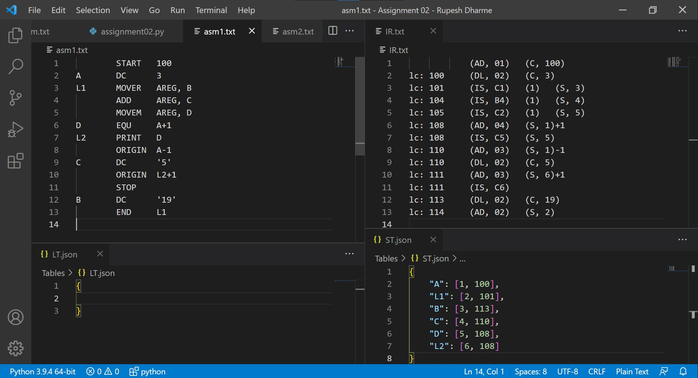
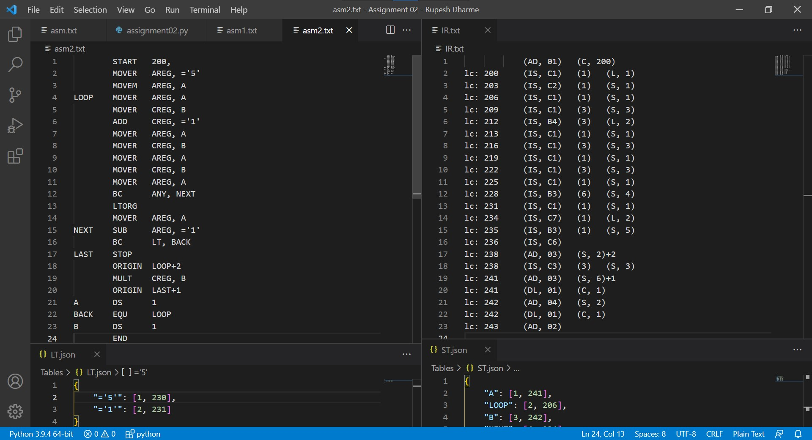
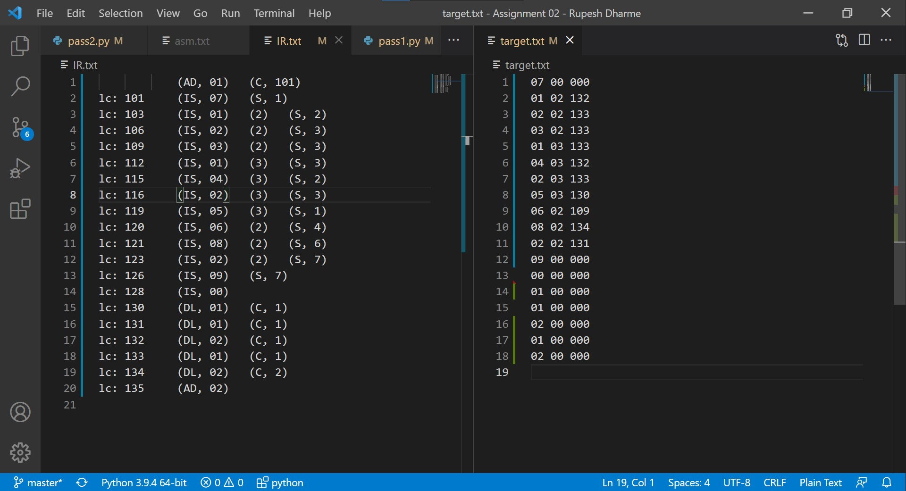
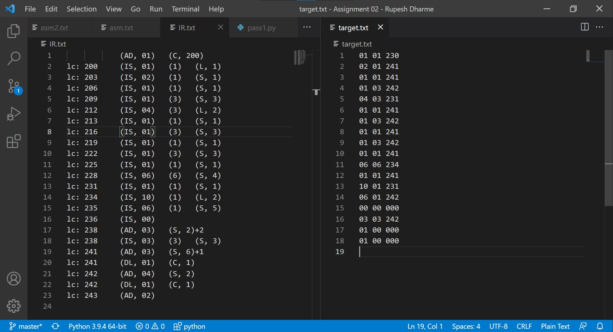

# Two Pass Assembler
An assembler is a program that translates assembly language code into 
machine language code.

## Types of assemblers
1. One pass assembler
2. Two pass assembler

# About this Repository
This is my implementation of a pseudo assembler in python which tries to 
simulate a two pass assembler.

Let's see how a two pass assembler works in short. It takes an .asm file(here it does take .txt) and a MOT and converts it into an intermediate code after pass 1. In pass one Symbol table and Literal table are also created which are used in pass two(also pool table).

In pass 2 the IR file is converted into machine code using ST and LT. That is a short overview you can [read more here.](https://www.geeksforgeeks.org/introduction-of-assembler/)

Here are some output snaps.
## Pass 1

## Pass 2

Though this won't simulate an assembler completely and may sometime give wrong outputs.
An actual assembler is far more complex and efficient.